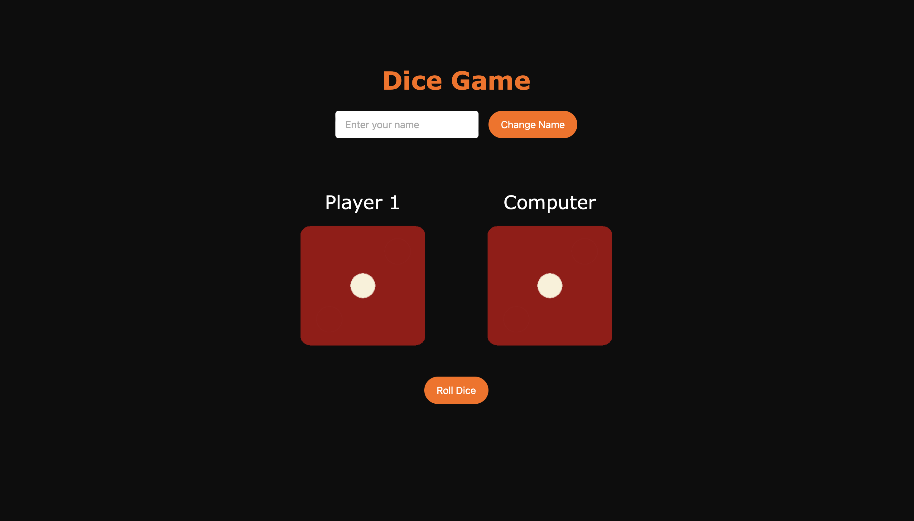

# Dice Game - React

This is a simple dice game built using React. The game features two dice: one for Player 1 and the other for the computer. The player can roll the dice, and the game will announce the result as "Win", "Lose", or "Draw" based on the dice outcomes. Additionally, Player 1 can change their username.

**Web app url**: https://dice-game-sage-beta.vercel.app

### Features

- **Two Dice**: One for the player and one for the computer.
- **Roll Dice Button**: Press the button to roll both dice. The dice faces will change for 3 seconds before stopping.
- **Game Result**: The result is displayed as "Win", "Lose", or "Draw" based on the dice outcomes.

    - If the player wins, the result turns green.
    - If the player loses, the result turns red.
    - If the game is a draw, the result turns orange.

- **Change Username**: Player 1 can change their username using an input field and "Change Name" button.

### Technologies Used
- **React**: A JavaScript library for building user interfaces.
- **JavaScript (ES6)**: For logic and functionality.
- **HTML/CSS**: For basic structure and styling.

### ScreenShot


## How to Run the Project

### Prerequisites
Make sure you have **Node.js** installed on your machine.

1. Colone the repository:
```
https://github.com/ozgurdayanir/dice-game.git
```
2. Navigate to the project folder
```
cd dice-game
```
3. Install dependencies
```
npm install
```
4. Run the project
```
npm run dev
```
5. Open your browser and navigate to localhost

### Future Improvements

- Add additional game modes, such as multiplayer or increasing difficulty.
- Add animations or sound effects to enhance the user experience.
- Store the player's score across multiple rounds.


